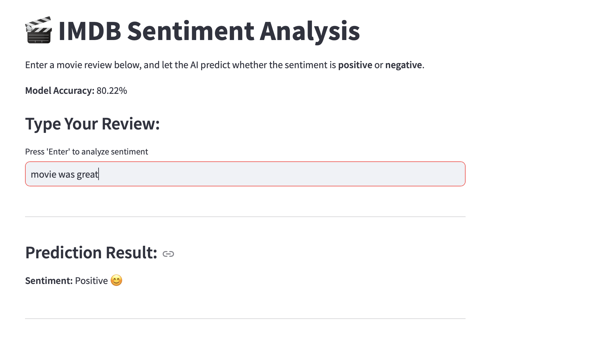
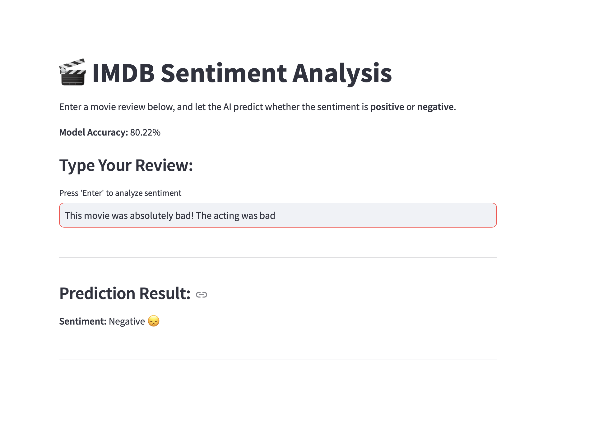

# IMDB Sentiment Analysis App

This application allows users to input movie reviews and get a sentiment analysis (positive or negative) using a Naïve Bayes classifier trained on the IMDB dataset.

## Model Accuracy
The current model accuracy is **80.22%**.

## Example Screenshots

### Positive Sentiment
This is an example of a review that the app has predicted as a positive sentiment:

### Negative Sentiment
This is an example of a review that the app has predicted as a negative sentiment:

